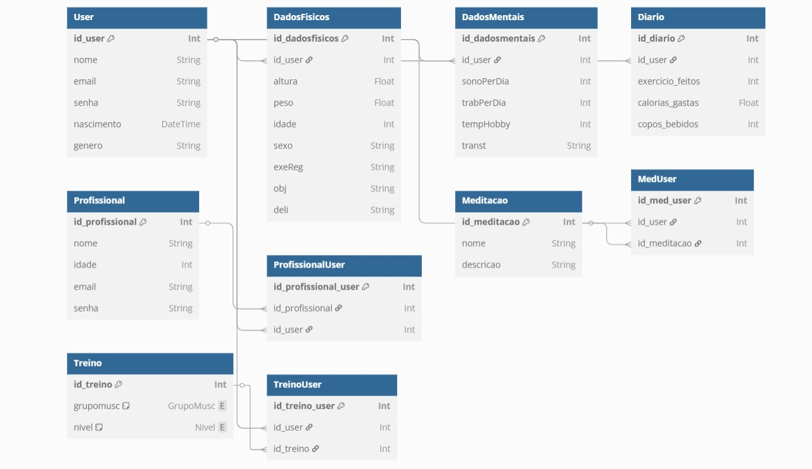
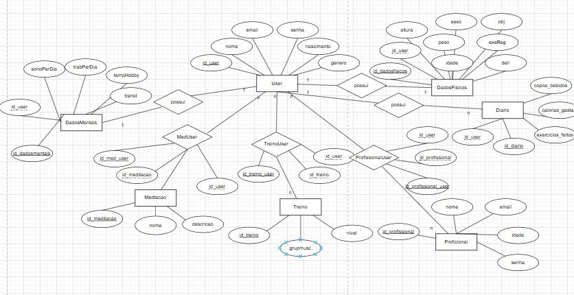
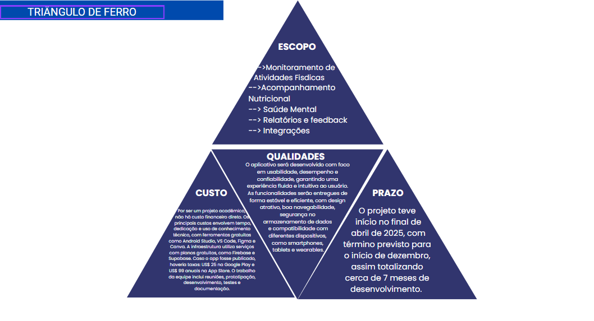
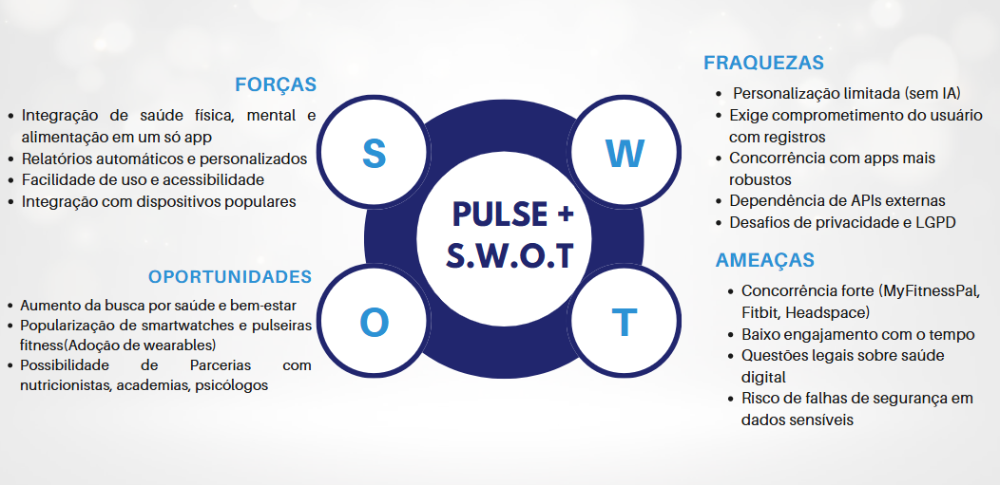
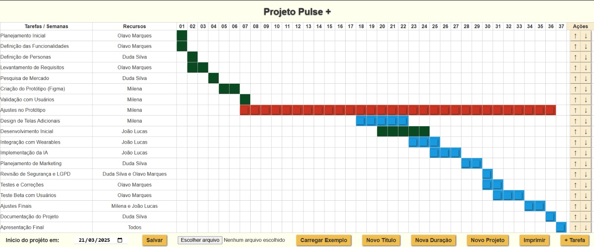

# Projeto-TCC
# Pulse+

**Pulse+** é um aplicativo voltado para o cuidado integral da saúde — mental, física e alimentar — oferecendo ferramentas práticas, conteúdo educativo e acompanhamento personalizado para promover o bem-estar dos usuários.

##  Sobre o Projeto

Pulse+ nasceu com o objetivo de integrar em um só lugar funcionalidades que incentivem uma vida mais equilibrada e saudável. O aplicativo permite que o usuário acompanhe sua rotina, registre hábitos saudáveis e receba orientações personalizadas.

###  Funcionalidades Principais

- **Saúde Mental**
  - Diário emocional
  - Meditações guiadas
  - Exercícios de respiração
  - Alertas de autocuidado

- **Saúde Física**
  - Registro de atividades físicas
  - Planejamento de treinos
  - Metas e progresso

  - Planejamento alimentar
  - Registro de refeições
  - Dicas nutricionais
  - Lembretes de hidratação

##  Tecnologias Utilizadas

- figma
- vsCode
- insominia
- draw.io
- Canva

##  Objetivo

Oferecer uma solução digital que ajude pessoas a monitorar e melhorar sua saúde mental e física , de maneira acessível, simples e intuitiva.

##  Protótipo

### Mobile:
https://www.figma.com/proto/Viq3FEL9eHNYxoNCbokoED/app-saude?t=svQYMTbgD4yqaVMl-0&scaling=scale-down&content-scaling=fixed&page-id=0%3A1&node-id=2-11&starting-point-node-id=2%3A11

### Web: 
https://www.figma.com/proto/Viq3FEL9eHNYxoNCbokoED/app-saude?node-id=143-612&p=f&t=1OR7K2tVsrW50HFI-0&scaling=scale-down&content-scaling=fixed&page-id=111%3A372&starting-point-node-id=143%3A612

##  Equipe

- João Lucas Ribeiro Leite - Programador back/mobile
- Maria Eduarda Silva Barroso - Scrum master
- Milena da Silva Felisbelo - Programadora front
- Olavo da Silva Marques - P.O./tester

## Analises:

### Diagrama de Classes:

### DER(Diagrama Entidade Relacionamento):

### Triangulo de ferro:

### Matriz SOWT:

### Gráfico Gant

### link versel:
https://backend-tcc-iota.vercel.app/

### link backend-tcc:
https://github.com/jaolucas1234/backend-TCC

### link Pages:
https://milenafelisbelo.github.io/front_tcc/

### link mobile-tcc:
https://github.com/jaolucas1234/mobile_tcc

