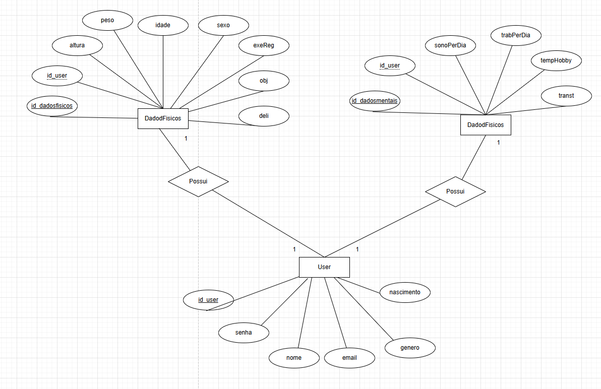

codigo prisma primeira att
```
generator client {
  provider = "prisma-client-js"
  output   = "../src/generated/prisma"
}

datasource db {
  provider = "mysql"
  url      = env("DATABASE_URL")
}

model User{
  id_user Int @id @default(autoincrement())
  nome String
  email String @unique
  senha String
  nascimento DateTime
  genero String
  Dadosfisicos DadosFisicos[]
  Dadosmentais DadosMentais[]
}

model DadosFisicos{
  id_dadosfisicos Int @id @default(autoincrement())
  id_user Int
  altura Float
  peso Float
  idade Int
  sexo String
  exeReg String
  obj String
  deli String?

  user User @relation(fields: [id_user], references: [id_user])

}

model DadosMentais{
  id_dadosmentais Int @id @default(autoincrement())
  id_user Int
  sonoPerDia Int
  trabPerDia Int
  tempHobby Int
  transt String?

  user User @relation(fields: [id_user], references: [id_user])
}
```


diagrama MER x DER primeira att:


